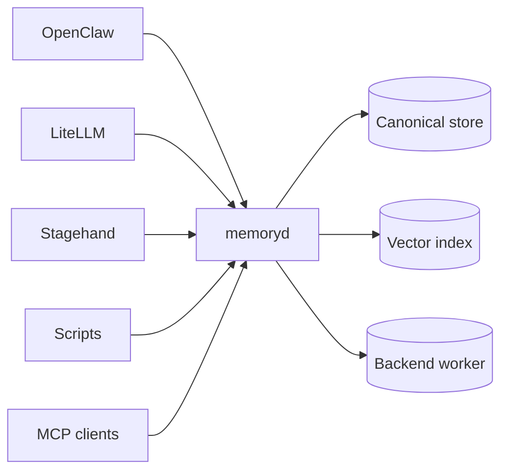
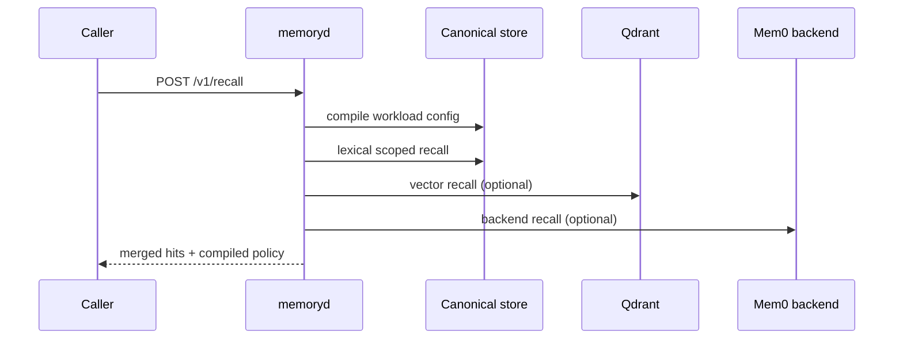
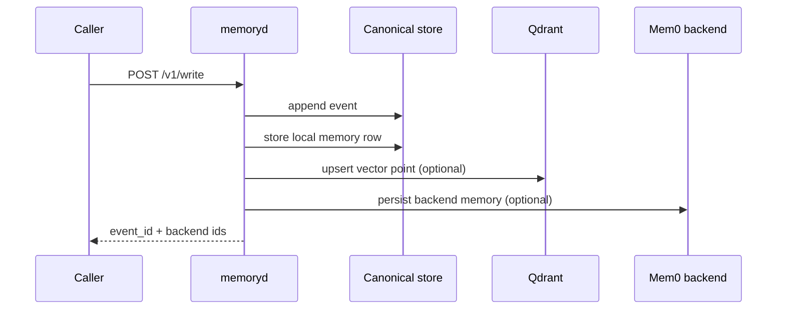
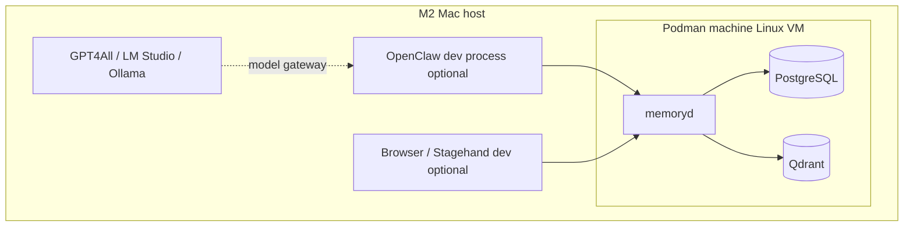
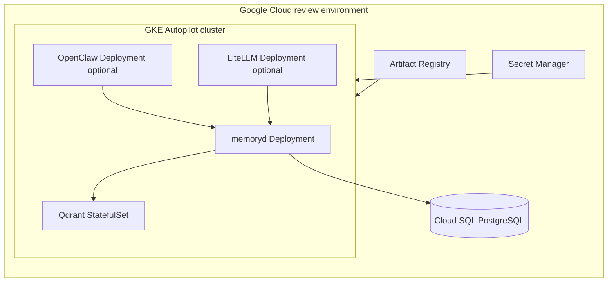

# Memorymesh architecture

## Status

This document defines the first coherent functional and technical architecture for `memorymesh`. It is intentionally opinionated. The goal is not to capture every possible topology. The goal is to define the default topology we will build, test, and harden.

The architecture has two first-class deployment models:

1. **Local developer model on an Apple Silicon Mac** using Podman.
2. **Cloud review model on Google Cloud** for design review, integration testing, and controlled multi-user experiments.

The local model is the default build-and-debug path. The cloud review model is the default path for shared review, policy validation, and early operational rehearsal.

## Problem statement

We need a memory substrate that survives across interfaces and runtimes.

The system must support:

- multiple caller interfaces such as OpenClaw, LiteLLM hooks, Stagehand, browser tasks, scripts, and future MCP clients;
- multiple memory scopes such as run, agent, user, workspace, and peer/federated domains;
- multiple storage and retrieval implementations such as canonical records, lexical search, vector search, and optional graph recall;
- multiple deployment environments, especially a local Apple Silicon laptop and a cloud review environment;
- explicit policy, observability, and identity, instead of hidden application-local state.

This is why the architecture is **mesh-inspired** instead of app-inspired. The center is not one product UI. The center is a control-plane plus data-plane contract for memory.

## What this system is and is not

`memorymesh` is:

- a control-plane and data-plane substrate for memory;
- a stable HTTP API (`memoryd`) for write, recall, config compilation, and watch streams;
- a policy surface for workload attachment, recall limits, export rules, and conflict handling;
- an adapter hub for upstream systems.

`memorymesh` is not:

- a single chat application;
- a hosted SaaS dependency;
- a generic vector DB wrapper with no policy;
- a replacement for every app-local cache or browser session store.

## Architectural motivations

### 1. Local-first is a development requirement, not a nice-to-have

The current Linux server path is not available. The immediate working platform is an M2 Mac. The architecture must therefore support a laptop-first execution model that still resembles the eventual distributed system.

### 2. Memory must be interface-neutral

If memory is trapped inside one UI, one agent framework, or one runtime gateway, cross-interface continuity fails. Memory must be callable from OpenClaw, LiteLLM, Stagehand, scripts, and future MCP clients without changing the underlying semantics.

### 3. The control plane must be separate from the storage engine

Mem0, Qdrant, PostgreSQL, markdown mirrors, and future graph engines are implementations and materializations. They are not the canonical API. The canonical API is `memoryd`.

### 4. We prefer explicit policy to invisible magic

Memory quality degrades when writeback, recall scope, retention, export, and conflict resolution are implicit. Those must be codified in explicit resources and compiled workload config.

### 5. Multi-architecture is a first-order requirement

The developer machine is `arm64`. Parts of the cloud estate may be `amd64`, `arm64`, or mixed. The build and deployment model must therefore prefer multi-arch images and architecture-aware scheduling.

### 6. Managed application dependencies are avoided; managed substrate can be pragmatic

We are not building around a managed memory product. We can still choose pragmatic infrastructure substrate in the cloud review model where that reduces operational drag without surrendering the application control plane.

## Design principles

1. **Canonical envelope first.** Every memory write and recall request carries `user_id`, `agent_id`, `run_id`, `workload_id`, `source_interface`, and optional workspace/channel metadata.
2. **One stable edge API.** Upstream adapters talk to `memoryd`, not directly to whichever backend seems convenient.
3. **Local-first recall.** Local scope is preferred before remote or backend expansion.
4. **Policy before retrieval.** The compiled workload config constrains recall order, limits, peer reach, and export behavior.
5. **Canonical records before derived indexes.** PostgreSQL is the canonical structured memory ledger. Qdrant is a derived retrieval index. Graph storage is optional and derived.
6. **Vector retrieval is useful, not sovereign.** Lexical, scope, and policy signals remain important.
7. **Adapters stay thin.** OpenClaw, LiteLLM, and Stagehand integrations should stay policy-aware but storage-agnostic.
8. **Supply-chain inputs are pinned and mirrored.** Runtime fetches from public registries are not acceptable in production.
9. **Local development must not require cloud credentials.**
10. **Cloud review must preserve topology semantics.** Do not choose a cloud runtime that erases the stateful/stateless distinctions we need to test.

## Functional architecture

### Functional capabilities

The system provides six core capabilities.

#### A. Memory write

A caller submits content plus the canonical envelope and the desired memory class.

The system:

- appends an event record;
- materializes local/canonical memory rows;
- optionally forwards to a backend worker such as Mem0;
- optionally indexes into vector search;
- returns event and backend IDs.

#### B. Memory recall

A caller submits a query plus the canonical envelope.

The system:

- compiles workload policy;
- resolves scope ordering;
- performs local lexical recall;
- optionally performs vector recall;
- optionally expands to backend workers;
- merges, scores, deduplicates, and returns bounded hits.

#### C. Workload configuration

A caller or sidecar asks for the compiled config for a workload. This config is derived from attached resources such as `MemoryAttachment`, `GlobalRecallPolicy`, `MemoryPeer`, `ExportPolicy`, and `ConflictPolicy`.

#### D. Config watch

Long-lived processes can subscribe to a config watch stream and react to policy changes without restarts.

#### E. Event inspection

Operators can inspect recent events for local debugging and audit.

#### F. Adapter mediation

Thin adapters translate native upstream conventions into the canonical envelope and the `memoryd` contract.

### Memory classes

The initial memory classes are:

- `interaction`
- `fact`
- `preference`
- `decision`
- `summary`
- `scratch`

The architecture treats these as policy cues, not mere labels. For example, `scratch` is expected to be short-lived and local. `fact` and `preference` are more likely candidates for long-lived durable retention.

### Scope model

The initial scope ordering is:

1. `run`
2. `agent`
3. `user`

This is the default, not a law. Workload policy can change the order or limits.

### Functional context diagram

## Technical architecture

### Core components

#### 1. `memoryd`

`memoryd` is the stable control-plane edge and service API. It owns:

- request validation;
- API-key enforcement when enabled;
- compiled workload config assembly;
- write-path orchestration;
- recall-path orchestration;
- event listing;
- backend isolation.

#### 2. Canonical store

The canonical store is the durable source of truth for:

- mesh resources;
- event records;
- local memory rows.

Local development may use SQLite. Cloud review should use PostgreSQL.

#### 3. Vector index

The vector index is optional but strongly recommended once semantic recall matters. The default vector engine in this architecture is Qdrant.

#### 4. Embedder

The current repository includes a deterministic hashing embedder for local usability. This is a development bridge, not the end-state embedding strategy.

#### 5. Backend worker

Mem0 is treated as a backend memory worker behind the `memoryd` API, not as the public API itself.

#### 6. Adapters

- LiteLLM hook: recall before LLM call; writeback after successful response.
- OpenClaw plugin and hooks: tools plus lifecycle writeback.
- Stagehand wrapper: explicit pre-recall and post-writeback around browser tasks.

### Request and writeback flows

#### Recall flow

#### Write flow

### Resource model

The initial resource model is intentionally small:

- `MemoryAttachment`
- `GlobalRecallPolicy`
- `MemoryPeer`
- `ExportPolicy`
- `ConflictPolicy`

The purpose of these resources is not to mimic Kubernetes for its own sake. The purpose is to make memory policy explicit and compilable.

## Local deployment model: Apple Silicon Mac with Podman

### Why this is the default local model

The working developer machine is an M2 Mac. Podman on macOS uses a Linux virtual machine, which means the local development model is still Linux-container based rather than a host-native divergence. That is useful because it keeps the local topology closer to the eventual cloud topology.

### Local topology

The recommended local topology is:

- host machine: macOS on Apple Silicon;
- Podman machine VM: Linux container runtime;
- containers:
  - `memoryd`
  - `postgres`
  - `qdrant`
- host-local runtime processes, optionally outside the compose group:
  - GPT4All desktop app
  - LM Studio or Ollama if used as local model providers
  - OpenClaw or browser debugging tools if we prefer host-native iteration

### Why LLM runtimes stay host-local in the first local model

On a Mac laptop, the local model runtime is tightly coupled to user workflows, hardware constraints, and sometimes GUI apps. The memory substrate does not need to containerize those runtimes immediately. The better first move is to make the memory plane stable and let local model runtimes attach through adapters or gateways.

### Local topology diagram

### Local operational choices

- Prefer `linux/arm64` images for local iteration.
- Use Rosetta only when testing `amd64` compatibility paths.
- Keep the local compose stack private to `127.0.0.1`.
- Use SQLite only for extremely fast single-process debugging; prefer PostgreSQL in the compose stack for realistic local behavior.
- Treat Qdrant as part of the default local stack once recall quality work begins.

## Cloud review model: Google Cloud

### Recommended review topology

The recommended cloud review model is:

- Artifact Registry for container images;
- GKE Autopilot for container orchestration;
- Cloud SQL for PostgreSQL as the canonical durable store in review mode;
- Qdrant as a self-managed StatefulSet with persistent volume;
- `memoryd` as a Deployment;
- optional LiteLLM and OpenClaw as Deployments;
- Secret Manager and workload identity for secrets and runtime identity.

### Why GKE Autopilot is the default review target

The architecture includes both stateless and stateful pieces. `memoryd`, LiteLLM, and OpenClaw are stateless-ish application services. Qdrant is stateful. PostgreSQL is durable infrastructure. A GKE-based review environment lets us preserve these distinctions cleanly.

### Why Cloud Run is not the primary cloud target

Cloud Run is excellent for stateless services, and it supports sidecars. But Cloud Run specifically supports Linux `x86_64` images for the container runtime contract, and the stateful Qdrant part of the system does not fit the platform as naturally as it fits GKE or VM-based deployment. Cloud Run remains a useful alternative for stateless review services, but not the primary topology for the full review stack.

### Cloud review topology diagram

### Cloud architecture options

#### Option A: Review-first hybrid cloud model (recommended)

- Cloud SQL for PostgreSQL
- Qdrant on GKE StatefulSet
- `memoryd` on GKE
- optional OpenClaw and LiteLLM on GKE

Why this is recommended:

- minimal stateful operational burden for canonical SQL storage;
- preserves the stateful semantics of Qdrant;
- keeps the app/control-plane components container-native;
- easy to evolve into a fuller sovereign stack later.

#### Option B: Fully self-managed cloud model

- PostgreSQL StatefulSet on GKE
- Qdrant StatefulSet on GKE
- `memoryd`, LiteLLM, OpenClaw on GKE

Why this exists:

- maximal control;
- consistent self-hosting posture;
- useful later if managed substrate becomes undesirable.

Why it is not the first review model:

- more operational drag before we have stabilized the app plane.

#### Option C: Cloud Run stateless edge plus external state

- Cloud Run for `memoryd` or LiteLLM
- Cloud SQL for PostgreSQL
- Qdrant on GCE or GKE

Why this exists:

- useful for quick public/demo ingress or isolated stateless service review.

Why it is not the default:

- split topology;
- Cloud Run x86_64 constraint;
- weaker fidelity for the full system.

## Build and image strategy

### Local and cloud image policy

1. Build multi-arch images for `memoryd` and adapters whenever practical.
2. Keep local M2 iteration `arm64`-first.
3. Ensure cloud images always include `linux/amd64` if Cloud Run is even a possible target.
4. Deploy by digest in shared or cloud environments.
5. Keep upstream resolution separate from runtime execution.

### Multi-arch rationale

A multi-arch image gives us one logical image reference that can run on both `arm64` and `amd64` environments. That keeps the Mac M2 local path and the cloud path from forking into unrelated build logic.

## Security and identity model

### Local

- bind services to localhost where possible;
- use development API keys for `memoryd` if needed;
- keep the Podman VM private;
- avoid public network exposure of Qdrant or PostgreSQL.

### Cloud

- prefer workload identity over static service-account keys;
- use Secret Manager for runtime secrets;
- use Artifact Registry and digest-pinned deploys;
- use private network connectivity for PostgreSQL and internal services;
- keep Qdrant private to the cluster.

## Observability model

Initial observability must include:

- health endpoints;
- event inspection;
- structured logs from `memoryd`;
- adapter logs for recall injection and writeback failures;
- deployment-level logs and container events in the cloud review stack.

## Testing strategy

### Local acceptance criteria

The local Apple Silicon developer model is acceptable when:

- `memoryd`, PostgreSQL, and Qdrant come up under Podman Compose;
- a write call persists and returns an event ID;
- a recall call returns at least the newly written item;
- the LiteLLM hook can round-trip recall and writeback against local `memoryd`;
- the OpenClaw plugin can invoke `memory_search` and `memory_write` against local `memoryd`.

### Cloud review acceptance criteria

The cloud review model is acceptable when:

- images are published to Artifact Registry;
- `memoryd` can connect to Cloud SQL and Qdrant;
- service-to-service traffic stays private;
- one end-to-end recall/write path works from a deployed adapter;
- deployments use digests rather than mutable tags.

## Current implementation mapping

Current repository code already maps onto this architecture:

- `services/memoryd/app/main.py` is the API edge.
- `postgres_store.py` and `sqlite_store.py` provide the canonical-store seam.
- `qdrant_index.py` provides the vector retrieval seam.
- `embedding.py` provides a local deterministic embedding bridge.
- `mem0_client.py` provides the backend worker bridge.
- `adapters/litellm/memory_mesh_hooks.py` is the LiteLLM adapter.
- `adapters/openclaw-memory-mesh/` is the OpenClaw adapter.

## Recommended next implementation steps

1. Stabilize the local Podman stack on the M2 Mac and make it the default developer workflow.
2. Build multi-arch images and publish them to Artifact Registry.
3. Stand up the GKE review environment with Cloud SQL and Qdrant.
4. Run end-to-end recall/write tests through at least one real adapter.
5. Only then decide whether to keep Cloud SQL in the long-term architecture or move fully self-managed.

## Open questions

1. When do we switch from the deterministic hashing embedder to a real embedding service?
2. When do we introduce graph recall as a first-class derived index?
3. Do we want LiteLLM in the first cloud review stack, or do we start with `memoryd` plus OpenClaw only?
4. Should PostgreSQL remain managed in cloud review, or do we want a fully self-managed control plane earlier?
